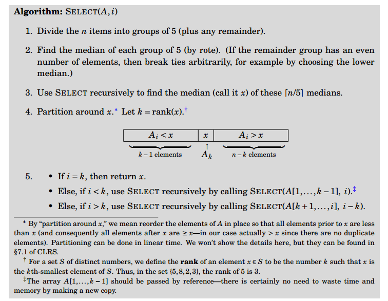

## The Quickselect algorithm  

The goal of the Quickselect algorithm is simple: quickly select the $k^{th}$ smallest element in an  
unsorted array of $n$ elements.  Note that the $({n \over 2})^{th}$ smallest element is the median.  

Lucky for me, a detailed explanation of how the algorithm works has already been  
provided by MIT in this really good picture, so I don't need to explain that at  
all!  

## Running time  

After we split the array into groups of five, if the number of elements in the array, $n$, is not a  
multiple of five, there will be one group at the end that does not have five elements.  Let's call  
this group the "remainder group".  

So, for an array of $n$ elements, there are **at least** $ceil({n \over 5}) - 1$ non-remainder groups  
of 5. This is because if $n$ is not a multiple of 5, there will be exactly $ceil({n \over 5}) - 1$ non-remainder  
groups of 5 and one remainder group of less than 5 elements. If $n$ **is** a multiple of 5, then there  
will be exactly $ceil({n \over 5}) = {n \over 5}$ groups of 5 without a remainder group left over.  

Now that we have our groups of 5, let's sort each of them separately.  Since each of these groups contains  
exactly 5 elements, a constant number of elements, running a sorting algorithm on each will take  
constant time $O(1)$. So, if we are doing an operation that's $O(1)$ for $n \over 5$ groups, then  
sorting all of those groups will take $O(n)$. Once all the 5-element subgroups are sorted, let's  
make a set of all their medians.  

Now we're going find the median of medians by calling Quickselect recursively on our set of medians.  
Since there were $n \over 5$ groups of 5 elements, there are also $n \over 5$ medians from which to find
the median of medians.  Therefore using Quickselect recursively on our set of medians will take $T({n \over 5})$.  Let's  
remember that for our recurrence relation much later and for now just assume we have the median of medians.  

With our median of medians that we just got, we're going to partition the array just like we did in  
Quicksort, using the median of medians as the pivot: we're going to put all elements less than the  
pivot to its left and all elements greater than it to its right.  If you don't remember how that's done  
take a look at the [notes on Quicksort](../qsort/qsort.html).  At this point we've got the array partitioned as shown in  
the first diagram, so all that remains is the recurive call.  But to figure out the Big-O  of the recursive  
call, we have to figure out the size of the sub-array we're going to call Quickselect on recursively.  

Remember that we are using Quickselect to get us the $k^{th}$ smallest element.  So, if, after  
partitioning using the median of medians, the position of our pivot is greater than k, we clearly  
have to call Quicksort on the subarray that's less than the pivot.  Converserly, if, after  
partitioning, the position $p$ of our pivot is less than k, we have to call Quicksort on the subarray  
that's greater than the pivot -- but now we're looking for the ${(p-k)}^{th}$ element in that subarray  
since all the elements in the subarray are greater than the $p^{th}$ smallest element in our original  
array and we were looking for the $k^{th}$ smallest element in our original array.  

So, now that we understand something about how we'll call Quickselect recursively on one of the two  
subarrays, how do we put an upper bound on their size that's useful for a recurrence relation so  
that we can understand Quickselect's Big-O?  Realize that putting an upper bound on the size of these  
subarrays is equivalent to putting an upper bound on the number of elements that are greater than or less  
than the median of medians.  Let's start with another great picture from MIT to get us all using the same  
visualization:  

 

Recall that the total number of 5 element groups, including the remainder group, is $ceil({n \over 5})$.  Notice that  
half of those groups can have medians that are greater than the median of medians.  Well, it's  
*not quite* half. If there are an odd number of groups then it would actually be the rounded-down  
version of half so let's say that there are at least $floor({1 \over 2} ceil({n \over 5}))$ groups of 5 elements  
whose median is greater than the median of medians.  Well, it's *not quite* that number either, since  
we shouldn't count the group that actually contains the median of medians.  So there are  
$floor({1 \over 2} ceil({n \over 5})) - 1$ groups with medians larger than the median of medians.  

So, what then is the minumum number of *elements* (not groups) that are greater than the median of  
medians?  Well for each group whose median is greater than the median of medians, there are at least  
3 elements that are greater than the median of medians.  So, you'd figure that it would be 3 times  
the expression we got at the end of the last paragraph.  The only problem is that the expression   
included the remainder group, which may not even have 3 elements, let alone 3 greater the median  
of medians.  So the answer is actually 3 times one less than that expression, or written in math:  
$3(floor({1 \over 2} ceil({n \over 5})) - 2)$.  Oh!  We almost forgot the two elements in the same  
group as the median of medians that are greater than it.  So our final expression for the minimum  
number of elements greater than the median of medians is $3(floor({1 \over 2} ceil({n \over 5})) - 2) + 2$.  By  
algebra we can show that this is greater than ${3 \over 10} n - 6$.  

Alright, we managed to put a lower bound on the number of elements that are **greater than** the median  
of medians, and this lower bound could just as easily apply to the number of elements that are  
**less than** the median of medians too.  So really, we put a lower bound on the *size* of the two  
subarrays that we'll be calling Quicksort on recursively.  What's more, for any expression of $n$  
that defines a lower bound on the size of the subarrays, $n$ minus that expression defines an  
upper bound!  So we finally have our upper bound on the size of these subarrays, and it's  
$n - {3 \over 10} n - 6\ =\ {7 \over 10} n + 6$.  

Therefore, the recurrence relation of Quicksort is $T(n) = T(ceil({n \over 5})) + T({7 \over 10}n + 6) + O(n)$.

By some sneaky involved math (proof by the Substitution Method), that recurrence relation solves  
to $T(n) = O(n)$.  For more information, check out [this document](mit_qselect.pdf) from which I stole all the  
diagrams and reasonings.
