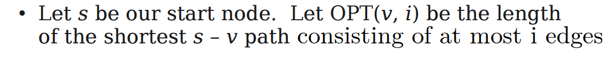
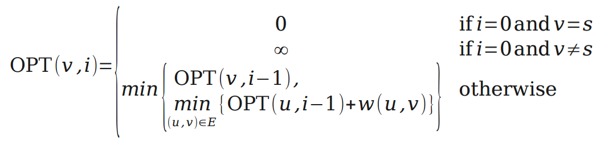
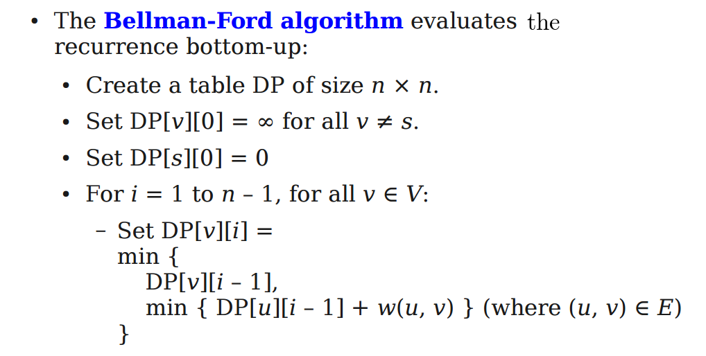
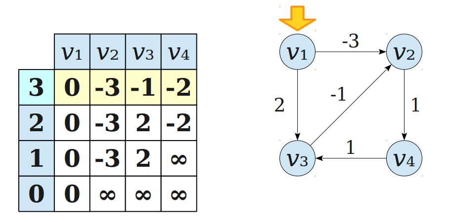
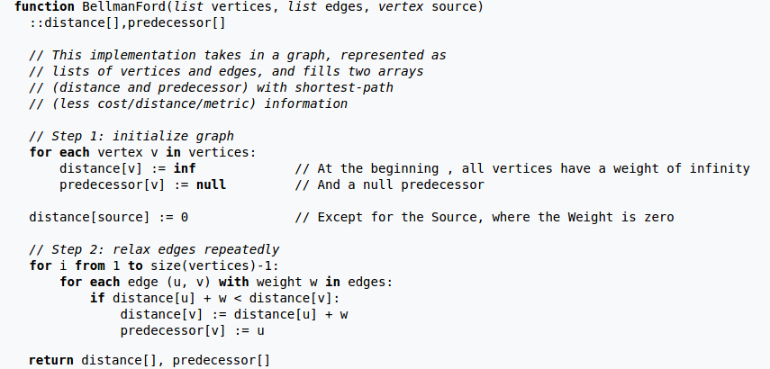
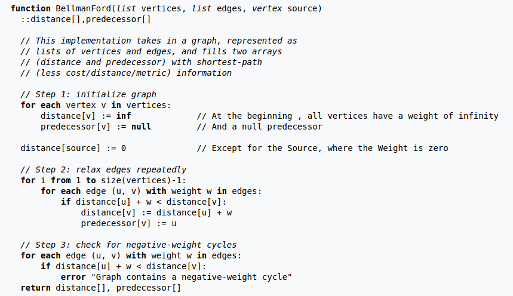

## The Shortest Path Problem  

Given a edge-weighted and directed graph, find the shortest path between any two nodes `s` and `t`.  We should all be well aquainted with this problem from the [notes on Dijkstra's shortest path algorithm](../../greedy/dijkstra/shortestDijkstra.html).  

## Negative Cycles  

We already saw that Dijkstra's Algorithm fails on DAGs with negative edge weights, but this time we're going to show some dynamic programming solutions to the Shortest Path problem that allow the DAG to contain negative edge weights.  However, we first need to discuss a case that can arise in a graph with negative edge weights that **no shortest path algorithm can handle**: the case of negative cycles.  

The idea is simple: somewhere in the graph, there exists a cycle whose edge-weights sum to a negative number.  This means that if we had some path between two nodes $s$ and $t$ not on the cycle, if the path chose to go around the cycle as many times as it wanted it could hypothetically have a path length of **negative infinity**.  This is clearly not valid.  The issue here is not so much that no algorithm can come up with ways to combat this issue, but rather than there is no good way to define path length when one of these negative cycles exists.  So, we come to the following conclusion:

> If some path from $s$ to $t$ contains a negative cycle, there does not exist a shortest $s \rightarrow t$ path (by the standard definition -- of course you might be able to write some custom algorithm that still finds the shortest path ignoring negative cycles).  Otherwise, there does exist such a path and it is 'simple' (no repeated vertices).  

Something to note: a simple path can visit at most $|V|$ number of vertices, and that path will therefore necessarily have $|V| - 1$ edges.  Therefore, the max number of edges in any shortest $s \rightarrow t$ path is $|V| - 1$.  

## Recursive Definition of Optimal Solution  

As discussed in [the notes on weighted interval scheduling](../weighted_intervals/weighted_interval.html), the general strategy of dynamic programming is to first make a recursive definition of the optimal solution and then to implement it either bottom-up or top-down.  Before reading on, recall that the length of the shortest path between two nodes is not defined by the number of edges in the shortest path but rather the sum of their weights.  

The Bellman-Ford algorithm relies on two principles to justify its dynamic programming recurrence:  

1.  For any node $v$, the shortest $s \rightarrow v$ path cannot consist of more than $|V|-1$ edges.  
2.  Though we cannot define a recurrence for any shortest $s \rightarrow v$ path, **we can** define the recurrence for length of the shortest $s \rightarrow v$ path consisting of $i$ edges or less.  That recurrence is:  

  

  

  

The interesting part of the recurrence is the "otherwise" case, which is defined as the minimum of two cases:  

1.  The shortest path from $s$ to $v$ in at most $i$ edges is actually the shortest path from $s$ to $v$ in at most $i-1$ edges.  
2.  The shortest path from $s$ to $v$ uses exactly $i$ edges, so we can therefore define the length of the shortest $s \rightarrow v$ path  as the minimum of, for all of $v$'s neighbours $u$, the length of the shortest $s \rightarrow u$ path in $i-1$ edges plus the edge weight of edge $(u,v)$.  We can obviously only apply this minimization to nodes $u$ that are adjacent to $v$ -- a.k.a. forall $(u,v) \in E$.  

## The Bellman-Ford Algorithm  

  

The algorithm returns the last row that it fills in.  Here's a demo of its execution on a simple example:  

  

Let's refer to the last row as the array `r[]`, where `r[v]` is the length of the shortest $s \rightarrow v$ path.  To reconstruct the $s \rightarrow v$ path itself you need only the array `r[]` and a very simple strategy:  

*  Start at the node $v$ of your choice (so start at `r[v]`).  Push $v$ onto a stack.  
*  Find $v$'s neighbour $u$ such that `r[u]` + $w(u,v)$ = `r[v]`.  Now push $u$ onto the stack.  
*  Repeat until you arrive at $s$, which you also push onto the stack.  Now pop the stack until empty to get the shortest $s \rightarrow v$ path.  

## Big O of Space and Time  

We don't really need a whole section for this.  The matrix `DP[][]` is $n^2$ so memory complexity is $\Theta ({|V|}^2)$.  Also, we iterate as many times as there are nodes and for each iteration we look at incident edges so that's time complexity is $\Theta (|V| \cdot |E|)$.  The 'path reconstruction' runs in $O(|V| \cdot |E|)$ also. 

## Practical Improvements  

Notice that as we fill any given row in the matrix, we only ever need to use the previous row.  So we should really only be using a single row of size $|V|$ during the entire execution of the algorithm.  Also, our reconstruction of the shortest path takes just as long as the algorithm itself, which is not great.  This is because in the reconstruction, just as in the regular execution of the algorithm, we have to look at all edges of each node before terminating.  

We can get around this by maintaining an array `prev[]` with one value for every node such that `prev[v]` is the node that comes before $v$ in the shortest $s \rightarrow v$ path.  Just as the length of the shortest path to a given node $v$ changes as the algorithm runs, so too do the nodes in that path and therefore the value of `prev[v]` may change during execution.  With the array `prev[]`, we will be able to reconstruct the path very quickly.  We just push $v$ onto a stack and then go to `prev[v]` and repeat until we are at $s$.  

Here's what the improved version of the algorithm looks like.  Note that while the memory needed is now only $O(|V|)$, the time needed has not changed.  In practice this version is much faster.  

  

## Using Bellman-Ford to Detect Negative Cycles  

Recall that no shortest $s \rightarrow v$ path can contain more than $|V|-1$ edges.  This is why the outer loop of the Bellman-Ford algorithm iterates $|V|-1$ times.  Therefore, all shortest paths should be set in stone by the end of the $|V|-1$ iterations of the outer loop.  If we ran the inner loop one last ${|V|}^th$ time and any of the shortest paths changed, we would know there's some kind of structure in this graph that makes the shortest $s \rightarrow v$ path somewhere in the graph **ever-changing**.  We know that negative cycles are the only way to cause infinitely-shrinking shortest paths so we have detected a negative cycle.  

To decect negative cycles we therefore run the inner loop one last time and if it would have made any changes we simply output that there have been negative cycles detected.  

  
