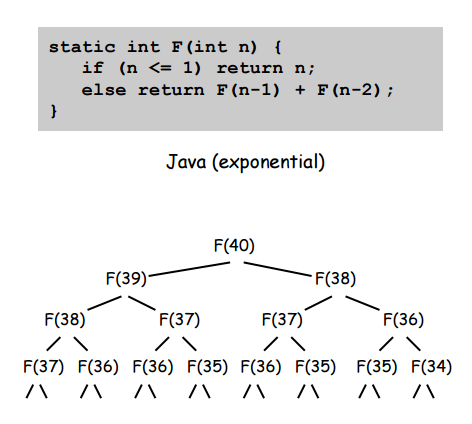
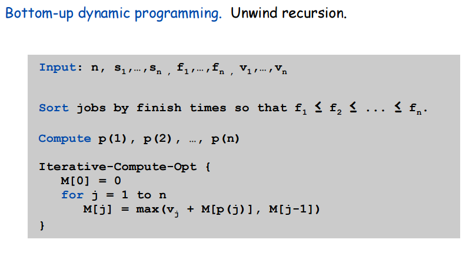

## Unweighted Interval Scheduling  

As we saw in the [notes on unweighted interval scheduling](../../greedy/intervals/intervals.html), there exists a greedy algorithm to solve the unweighted version of the problem.  But if each of the intervals also has a weight and the goal is not to maximize the number of intervals selected but rather to maximize the sum of the weights of the intervals selected, the greedy algorithm fails miserably.  This is shown clearly in the picture below:  

  

## Dynamic Programming -- General Idea  

The general strategy in dynamic programming is apply recursion except with *memory of the results of recursive calls*.  In other words, you still break down a problem into one base case and a bunch of smaller, self-similar problems, except that now you store the results of the sub-problems so you don't repeat having to solve them.  Take for example a simple recursive Fibonacci implementation in java:  

  

The obvious problem with this implementation is that you have to recalculate the values of many of the Fibonacci numbers many times.  A better way of doing this would be to store the results of every calculated value so that any other calculation that required a number we had already calculated would just have to look up the answer in a table instead of doing a whole recursion tree to recalculate the answer.  

This is the general idea of dynamic programming.  It doesn't always involve a problem with an obvious recurrence relation at its foundation or even recursion at all, but it's always about storing the results of subproblems so that the larger problems can use their stored solution without having to recalculate.  

## Weighted Interval Scheduling -- Prereqs  

Before we dive into the solution its dynamic programming optimization, let's just take a look at some quick ideas about the problem so we can better understand what we have to do to solve it.  First, consider a bunch of weighted intervals sorted by finishing time:

  

Let's define a term, $p(j)$.  For the $j^{th}$ interval of the sorted-by-finishing-time intervals, $p(j)$ returns the largest index $i$ such that the $i^{th}$ inteval is compatible with the $j^{th}$ interval.  For example, in the picture above, $p(8)=5$, $p(7)=3$, and $p(2)=0$.  

Let's define another term, $OPT(j)$.  $OPT(j)$ is the value (i.e. the sum of the weights) of the optimal solution to the problem consisting of intervals $1,2,\ldots j$.  Let's notice that there are two recursively defined cases for the value of $OPT(j)$:  

1.  Case 1: $OPT(j)$ includes intervals $j$  
    *  $OPT(j)$ can't use incompatible intervals $\{ p(j) + 1, p(j) + 2, \ldots , j - 1 \}$  
    *  $OPT(j)$ must be equal to $OPT(p(j)) + value_j$  
2.  Case 2: $OPT(j)$ does not include interval $j$  
    *  $OPT(j)$ must equal $OPT(j-1)$  

Therefore, we have defined $OPT(j)$ as follows:  
$$
OPT(j) = 
\begin{cases}
0 & j = 0 \\
max\{value_j + OPT(p(j)), OPT(j-1)\} & j \ne 0
\end{cases}
$$

So, after sorting the intervals by finishing time, we can clearly solve this problem just by calling a recursive function `OPT(j)` that is defined as above.

## Bruteforce Solution to Weighted Interval Scheduling  

Based on our definition of $OPT(j)$, we know that our algorithm will basically boil down to the following pseudocode (after sorting intervals by finishing time):  

~~~
OPT(j) {
    if (j == 0) {
        return 0
    } else {
        return max(v_j + OPT(p(j)), OPT(j-1))
    }
}
~~~

The obvious problem with this implementation is the same as with the 'naive' implementation of the recursive Fibonacci function: many of the recursive calls will recalculate the same values over and over.  On top of recalculating `OPT(j)` redundantly, `p(j)` will also be recalculated redundantly.  Why not store both in an array for all values of j each time they're calculated?  This is the dynamic programming solution to the problem.  

Before we see the solution though, let's try and actually figure out how bad the non-dynamic version is.  Well, the exact number of calls and value of `p(j)` is heavily dependent on the exact intervals in a given instance of the problem, but it turns out that the regular recursive algorithm behaves just as badly as regular recursive Fibonacci: the value of j is roughly the height of a binary tree! In other words, the algorithm runs in $2^n$ even if we compute all values of `p[]` beforehand.  

## Dynamic Programming Solution  

We know that the solution is the same as the one from the last section but with just two differences: maintain two global arrays, one for `p[]` and one for `opt[]`, and then apply the recursive strategy as before.  The pseudocode is given below:

~~~
Sort n intervals by finishing time

For j = 1 to n
    Calculate and store p[j]
Endfor

For j = 1 to n
    opt[j] = empty
Endfor
opt[0] = 0

function Opt(j) {
    if (opt[j] is empty) {
        opt[j] = max(v_j + Opt(p[j]), Opt(j-1))
    }
    return opt[j]
}
~~~ 

## Running Time  

Sorting the array by finishing time takes $O(n \log(n))$  
Computing $p(n) \forall n$ takes $O(n \log(n))$ (using binary search)  
Computing $OPT(n)$ using recursion and 'memoization' (storing sub-results) takes $O(n)$  

## Bottom-Up Solution  

Instead of using a recursive `Opt(j)` that has to recurse to the beginning of the intervals and then work its way to the end to give the final result, why not just use an interative solution to start at the beginning and then exit the loop and return the final value.  

  

## Getting the Intervals Themselves  

The only possible issue with what we've discussed is that while our dynamic algorithm can give us the final value, it cannot give us the intervals themselves.  This is common in dynamic programming.  Also common in dynamic programming is that since we have stored the values of all the sub-problems, we can usually somehow backtrack through those stored solutions to retrieve the full solution in decent Big-O.  

In this case, the idea is simple.  How do we know if a given interval was used to get the final value `opt[n]`?  The same way we decided if it was going to be used to calculate `opt[n]` during the execution of the algorithm: if $v_j + OPT(p(j)) \gt OPT(j-1)$ then interval j is in the solution set.  The pseudocode for this is shown below, and recall that both `p[j]` and `opt[j]` were defined for indices $1 \ldots n$.  

~~~
FindSolution(j) {
    if (j < 1) {
        return
    }
    else if (v_j + opt[p[j]] > opt[j-1]) {
        print j
        FindSolution(p[j])
    }
    else {
        FindSolution(j-1)
    }
}
~~~
