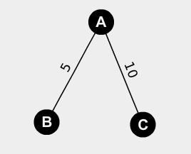
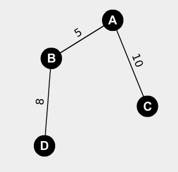
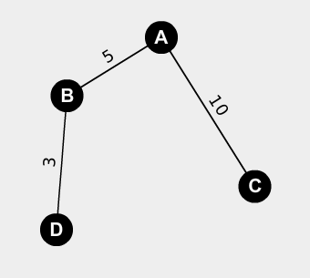
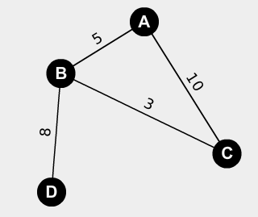
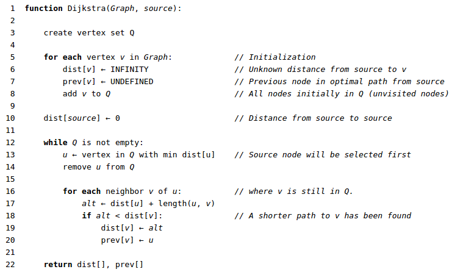
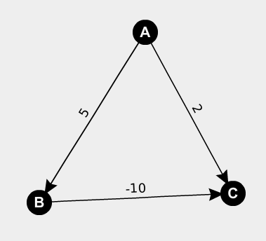

## Dijkstra's Shortest Path -- The General Idea  

Dijkstra's Shortest Path Algorithm (DSPA) is a certain kind of graph traversal for weighted graphs.  Like all graph traversals, it begins at the root node of your choice.  The difference is that when DSPA terminates, you will have the path-length and path taken for all the shortest paths from the root node to anywhere else.  That's the point of DSPA -- to get you the shortest path from the root to all other nodes.  

The way DSPA works is very similar to a breadth-first traversal.  In a breadth-first traversal, you visit a node and then enqueue all its unvisited neighbours.  The next node to visit is just the next node you dequeue.  You just repeat that over and over.  

In DSPA, you don't just immediately enqueue all the unvisited neighbours.  In order to make sure that the path you take to each node is the shortest one, you clearly have to keep track of the shortest-path-so-far to each node encountered as a neighbour.  So DSPA tries to figure out which neighbour-node is closest to the starting node and then makes some decisions and then does some enqueuing.  Before we talk about how that's done and dive into some pseudocode and more details of DSPA, let's just look at how the DSPA behaves in a bunch of cases to get an intuition for how it works.  

## Some Exemplary Behaviour  

Let's remember that the ultimate goal is to know the shortest-path-length and shortest-path itself from root to all other nodes.  This is achieved by actually traversing the graph in order of which node is closest to root.  I repeat: DSPA traverses the graph in order of which node is closest to root.  So, in the following examples where node A is the root (as it will be for all future examples), what is traversal-route taken by DSPA through the graph?

  

If your answer was A-B-C then congratulations.  DSPA started at A and recorded that the path-length to A is 0.  Then it looked at A's neighbours.  It saw that B was unvisited and that the distance from A to B is 5.  It also looked at C and saw that it was unvisited with a distance-from-A of length 10.  Since B was the closer-to-root unvisited node, it visited B.  Now that it was at B, it saw that B has no unvisited neighbours.  Therefore, it didn't have to think about anything and just went to the next closest-to-A node that it knew about, node C.  In the end, it had recorded that B had a shortest-path-length of 5 and that C had a shortest-path-length of 10.  

Now I know what you're wondering: you've shown me how it records the path length for that simple example, but what about the path itself? How does it record that?  

We'll get there, but first let's look at another example.  And when you figure out the traversal route, try and actually do it the way the algorithm does it.  Start at the root node and think about where to go next and what to do when you get there.  

  

So, the answer was A-B-C-D.  But what did the algorithm do?  It visits at A and looks at A's unvisited neighbours.  It notices that B has shortest-path of length 5 with shortest-path-parent A.  It notices C has shortest-path of length 10 with shortest-path-parent A.  Since B has the smaller shortest-path-length, it picks B to visit next.  Just know that **it didn't pick B by directly comparing** B's shortest-path-length to C's shortest-path-length.  Rather, **it put them both in a priority queue where the key is the shortest-path-length**, and then it just took the first element out of that priority queue to visit next.  In this case, that element was B, so it visits B (so just remember for later that this means that C is still in the priority queue).  At B, it sees only one unvisited neighbour, D.  It records that D's shortest-path-parent is B.  Knowing this, it determines that D's shortest-path-length is 8 plus B's shortest-path-length.  So it gives D a shortest-path-length of 13 and puts it in the priority queue.  Now that it's done with D, it dequeues a node from the priority queue, which in this case will be C.  So it visits C and does nothing else with C since C has no unvisitied neighbours.  Then it visits the last element in the priority queue, D.  D also has no neighbours and since nothing is left in the priority queue DSPA terminates.  

As we saw, DSPA is really very similar to a regular bread-first traversal with the major difference being that we use a priority queue instead of a regular queue. Since the key for the priority queue is the shortest-path-length, we'll see that DSPA doesn't necessarily visit the nodes layer by layer but rather just in ascending order of shortest-path-length.  The other major difference is that DSPA is constantly keeping track of two pieces of information about each node that it visits or encounters as a neighbour: shortest-path-parent and shortest-path-length.  We saw that DSPA needs both a node's shortest-path-parent and the shortest-path-parent's shortest-path-length in order to get a node's shortest-path-length.  

Let's look at another example to see if you're getting the idea.  

  

The traversal path taken by DSPA is A-B-D-C.  

OK, so like before, we start at A and give it a shortest-path-length of 0 with no shortest-path-parent.  Then looking at its unvisited neighbours B and C, we give B a shortest-path-length of 5 and C a shortest-path-length of 10 (obviously both have shortest-path-parent A).  We then enqueue B and C and then dequeue+visit B since its smaller-then-C's shortest-path-length means it is dequeued before C. At B, we give D a shortest path length of 5+3=8 and a shortest-path-parent of B and then enqueue D into the priority queue.  The next node to be dequeued is D since 8 < 10 so we visit D.  D has no unvisited neighbours so we're done with it.  We finally dequeue and visit C which leaves us with nothing to do so we terminate.  

We're getting the hang of it.  Here's one final example to see if you get it.  

  

The path taken is A-B-C-D.  

Again, visit A and give it shortest-path-length of 0 with no shortest-path-parent.  Give B shortest-path-parent A and shortest-path-length 5.  Give C shortest-path-parent A and shortest-path-length 10.  Enqueue B and C into priority queue and dequeue+visit B which has lower shortest-path-length than C.  Give D shortest-path-parent B and shortest-path-length 5+8=13.  **Now, here's the final thing to get**: B has C as an unvisited neighbour just as C was also A's unvisited neighbour, so what do we do?  We update C's shortest-path-parent and shortest-path-length if the updated length is less than the current one.  In this case it is, sine 5+3 < 10.  So we go update C's values and position in the priority queue by removing it from the queue, setting its parent and length to B and 8, and then we put it back in the priority queue.  **Now, we can continue as usual**.  We dequeue to get C since 8 < 13 and visit C.  We have nothing to do at C so we visit D, the last element in the queue.  Then we terminate.  

If you understand the last aspect of the DSPA, that if a neighbour node has a smaller shortest-path-length when considered from a different parent then its info should be updated and it should be re-inserted into the priority queue, then you now understand DSPA.  All that's left to do now is look at some pseudocode and maybe an implementation.  

## Implementation  

  

Notice that instead of an `if` statement checking that no visited node is being revisited or re-added to the queue when it has already been visited and removed from the queue, there is a comment that says 'where v is still in Q'.  In real implementations this `if` statement is required.  

## Negative Edge Weights  

We didn't mention this earlier to avoid confusion, but DSPA doesn't work on graphs where any of the edges have negative weights. Why is this?  Well, there are many complications that arise from negative edge weights but we'll look at the simplest reason why DSPA doesn't work on negative weighted graphs.  Consider the following graph:

  

We know that DSPA will go from A to C to B.  The problem is, the shortest path to C is clearly A-B-C not just A-C, since $5-10=-5<2$.  So, DSPA fails on negative weights.  
