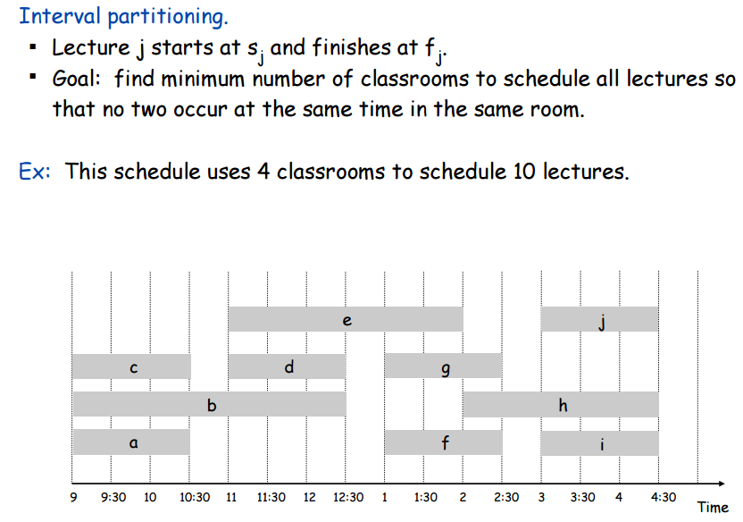
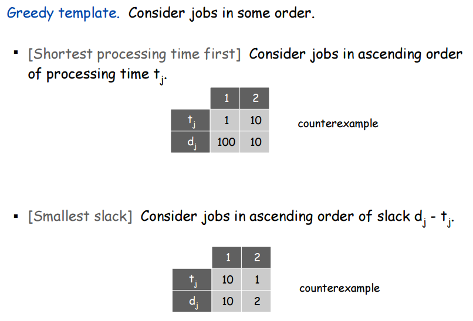
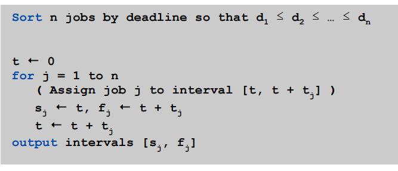
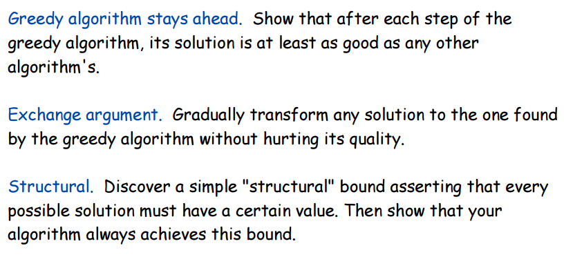

## Interval Scheduling  

  

The interesting thing to realize about the interval scheduling problem is that it is only asking "**which non-overlapping intervals should we choose so that we can keep the highest number of intervals**".  The question has nothing to do with re-scheduling the appointments that these intervals might represent.  They all start and end at fixed times and we accept that we can't keep all of them.  The goal is only to choose the ones that let us keep the most possible.  

So how can we solve this?  Well, there happens to be very simple Greedy Algorithm to solve this problem.  But what are thooooossee?  

Greedy algorithms are algorithms that, at every point in their execution, have some straightforward method of choosing the best thing to do next and just repeatedly apply that method to the remaining things to do until they are done.  To be honest, I think Wikipedia says it better:  

>  A greedy algorithm is an algorithmic paradigm that follows the problem solving heuristic of making the locally optimal choice at each stage with the hope of finding a global optimum.  

You should know that there are many cases where greedy algorithms are, in principle alone, not capable of finding the global optimum.  Not for the problem we're here to talk about though!  

As it turns out, there exists a greedy algorithm to solve the interval scheduling problem that can be proven to always find the optimal solution.  

The optimal algorithm is 2 steps:  

1.  Sort the list of intervals $(s_i,f_i)$ by finishing time $f_i$.  
2.  While elements remain in the list, add the soonest-ending interval compatible with the exisiting solution set to the solution set.  

It's not obvious that this algorithm produces the optimal solution. It does, though.  How do we prove this?  By contradiction.  

  

As we can see in the picture, there are two reasons why the greedy is the optimal. First, even though we chose the maximal value of $r$, there really is no reason to choose the optimal's ${(r+1)}^{th}$ choice over the greedy's ${(r+1)}^{th}$ choice.  The greedy's choice must end soonest, which means that it makes more room for all future choices than any other choice does.  So, between the greedy's ${(r+1)}^{th}$ choice and the optimal's ${(r+1)}^{th}$ choice, the greedy's ${(r+1)}^{th}$ choice is actually **more  optimal**.  So if this optimal was truly the optimal it would make the same ${(r+1)}^{th}$ choice as the greedy. Second, since the greedy's ${(r+1)}^{th}$ choice ends the soonest, both the greedy and the optimal have the same choices available for their ${(r+2)}^{th}$ choice, and once again the greedy's ${(r+2)}^{th}$ choice would be the most optimal. Thus we have shown that the greedy algorithm consistently makes the best decision and that even though we picked $r$ to be as large as possible, it clearly could have been larger and that's a contradiction so our proof by contradiction is  complete.  

## Interval Partitioning  

  

Notice that in the image above, there are at most 3 lectures that are running at every moment in time.  This is called the **depth** of the set of intervals.  Notice also that in the pecture above, 4 classrooms are used, despite the depth of the set of intervals being 3.  Below, a solution is shown that uses only 3 classrooms for the same set of intervals.  

  

This is a better way to partition the intervals since it uses only 3 classrooms.  Notice that the number of classrooms used is equal to the depth of the set of intervals.  A good question is whether or not this is always possible?  It's obvious that the number of classrooms needed is at least the depth of the set, but does there always exists a partitioning that uses exactly the number of classrooms as the depth of the set **and no more**?  

Not only is the answer yes, but -- you guessed it -- there's a greedy algorithm to solve this problem too!  

~~~
Algorithm Interval Partition {
    Sort all intervals by start time

    While there are intervals left {
        Let i be the next one

        If there is an existing classroom whose
        schedule is compatible with i {
            Add i to the compatible classroom that has been
            free for the longest time
        }
        Else {
            Create a new classroom and add i to it
        }
    }
}
~~~

Some details about the algorithm above:  

*  A good way to store the classrooms is in a priority queue.  Priority is given to classrooms that have been free the longest -- in other words, classrooms whose last scheduled interval had the earliest ending time.  
*  This algorithm runs in $O(n\ log(n))$ time.  First, it's clearly $O(n\ log(n))$ for the sorting of the intervals.  Then, for each of the $n$ intervals, we must choose a classroom to add them to.  This choice takes at worst $O(log(n))$ (assuming we implement the priority queue as a heap), since each time we add to a classroom, we need to remove it and re-instert it into the priority queue since its key for the priority queue (the ending time of its most recent interval) has been changed.  

So it runs fast, but how do we know that it gives the optimal solution?  With proof, of course.  For the following proof, keep in mind that our algorithm never schedules two overlapping intervals in the same classroom.  

Before we start the proof, just know that the way the proof works is to show that the algorithm would use $D$ classes to partition the intervals only if at some point $D$ intervals overlapped with each other.  This is clearly equivalent to proving that $D$ is the **depth** of the set of intervals.  

Okay so let's say that the greedy partitioning algorithm terminates with $D$ classrooms used.  The $D^{th}$ classroom was only used because it was trying to add some interval $I$ that was incompatible with the other $D-1$ classrooms.  The algorithm decides $I$ is incompatible on the basis that the other $D-1$ classrooms has intervals ending after $I$'s start time.  And since the algorithm adds intervals in ascending order of start times, the other classrooms' last intervals has to start before $I$ starts.  So we have shown that the other classrooms' last intervals started before $I$ and ended after $I$ started -- therefore they all overlap with $I$.  Thus we have shown that if the algorithm uses $D$ classrooms, it is only because there are $D$ overlapping intervals.  Proof is done.  

## Minimizing Lateness  

Imagine we have a bunch of jobs to do **one at a time** where each job has two properties: a duration and a deadline.  We want to schedule these jobs so that the maximum amount time that any single job is past its deadline is minimized.  We are **not** trying minimize total lateness, just *maximum* lateness.  Here's a graphic to some up the situation:  

  

Considering this webpage is all about greedy algorithms, we're going to try and solve this greedy-style.  Let's start by imposing some sorting order on the jobs.  We can either sort them by in ascending order of duration $t_j$, ascending order of deadline $d_j$, or ascending order of the latest time the job can start without being late, "slack time", deadline minus duration $d_{j} - t_{j}$.  We will choose to sort by deadline because of the following two counterexamples that show that sorting by duration or slack time does not minimize lateness.  

  

Our algorithm is greedy and we have sorted the jobs by deadline so all that's left to do is add them in order of deadline.  We literally add the one that needs to be done the soonest to the earliest time possible and then just repeat until nothing remains.  On the off chance that's not clear, here's some pseudocode:

  

That's it!  This greedy algorithm produces the optimal solution schedule for the minimizing lateness problem.  As a final note, here are some tips for how to analyze greedy algorithms and determine if they are optimal.

 
