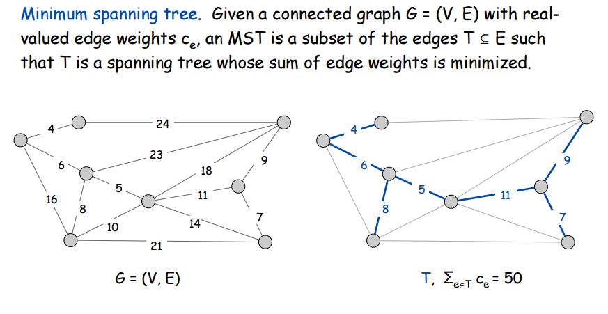
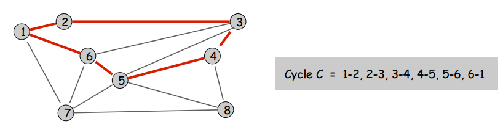
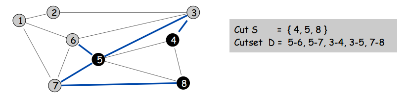
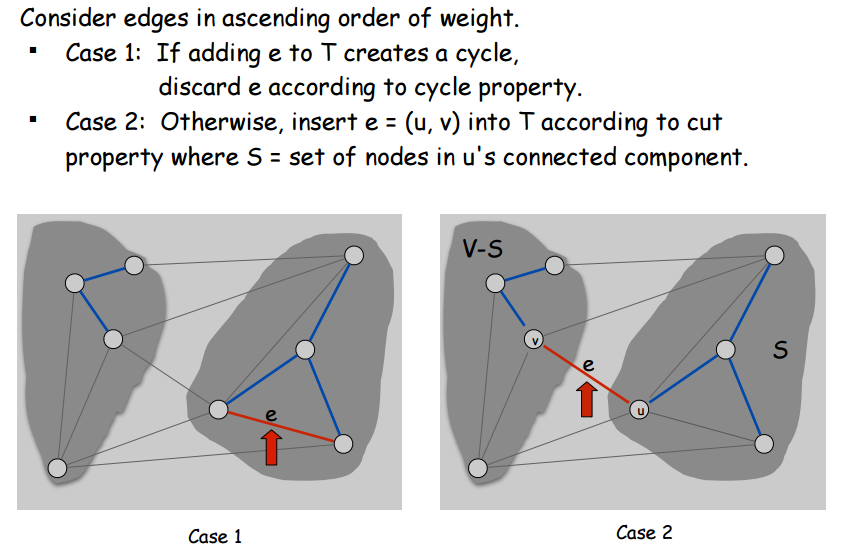
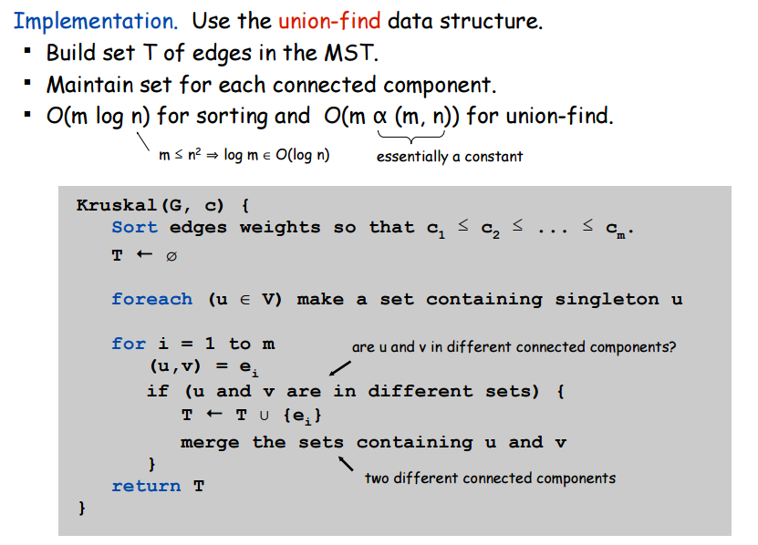

## Spanning Trees  

A Spanning Tree, or ST for short, is a subset of a graph that **contains every node** but not every edge.  In this way, the Spanning Tree "spans" the entire graph using only some of the edges.  

## Minimum Spanning Trees  

What, then, is a *Minumum* Spanning Tree?  It's a Spanning Tree that uses the minimum number of existing edges to still be a spanning tree.  But we only care about edge-weighted graphs since they're way better at modelling real life and are therefore an extemely practical data structure.  In the case of edge-weighted graphs, a Minimum Spanning Tree (MST) does not use the minimum number of edges but rather minimizes the sum of edge weights.  Here's a picture to illustrate:  

  

There's something really important to realize about minimum spanning trees: we don't care how large the sum of the weights are for a given path to and from any node in our MST.  We **only** care about the sum of the weights of all the edges in the MST.  No matter how ridiculously huge a particular path in the MST is, if the sum of all the edge-weights in the MST is minimum possible to still reach every node, then it's the MST.  

## Cuts and Cycles and Cutsets  

A **cut** of a graph is just a subset of nodes.  A **cycle** of a graph is a subset of edges that form a closed loop.  The **cutset** of a cut is the set of edges with only one endpoint in the cut.  Some pictures to explain these terms:  

  

  

## Graph Properties About Cuts, Cycles and More  

Here's an interesting and (as you'll soon find) very useful fact: **all cutsets and cycles always share an even number of edges** (or none at all, but who cares about the trivial case).  Not that this counts as proof, but here's an example of that being true.  In the following picture, you will not be able to construct any cycles or cutsets for which this property does not hold.  

  

But why is this true?  How can we understand this?  Let's look at a picture which, though it's not a formal proof, demonstrates why this property is always true for all graphs:  

  

This picture shows us that each time a cycle enters and exits a cut, it must share two edges with the cutset.  Thus a cutset and a cycle must always share 0 or an even number of edges.  

Here's another interesting fact: In any given graph, for any cut we take of that graph, the minimum edge in that cut's cutset **must** be in the MST **of the graph as a whole**.  Why is this necessarily true?  We can prove it using one of the greedy analysis strategies discussed at the bottom of the [page about interval scheduling](../intervals/intervals.html), the "exchange strategy".  Basically the proof is as follows and uses the picture below as visualization:  

  

T\*, the MST, should have only one edge connecting S to V-S.  If it had two edges connecting S to V-S, such as f and e, then clearly there would be a cycle and one edge would be removable so we wouldn't have an MST.  The one edge that connects S to V-S that should be in the MST, a.k.a. the one edge is S's cutset that should be in the MST, is obviously the minimum edge in S's cutset.  If we used any other edge in S's cutset, T\* wouldn't be the MST.  

Before I continue to the last property we're going to talk about, consider that we have assumed that f and e do not have equal weights.  It may be that future algorithms we discuss for finding the MST increase in complexity when we cannot make this assumption.  

Here's the final interesting fact/property about graphs: In any given graph, we can be sure that the **max-valued edge in any cycle is not in the graph's MST**.  This property, just like the property about the minimum edge in any cutset needing to be in a graph's MST, doesn't really need any formal proof.  Like last time, here's a visual aid so you can follow the proof visually:

  

Say we have some graph with MST T\*.  And let's say that edge f is in T\* but is also the maximum edge in some cycle L in the graph.  If we remove f from T\*, T\* will now not be able to reach some cut of the graph which we'll call S.  We know that f is in the cutset of S.  We also know that there is another edge in f's cycle L that is also in the cutset of S.  Even more than that, we know that this other edge, let's call it e, must connect S and V-S since e is in S's cutset and no nodes exist other than those in S and those in V-S.  Since e can connect S and V-S just as well as f was doing, and we know e's weight is less than f's since they're both in the same cycle L of which f is the maximum edge, T\* with e instead of f clearly is an MST with smaller total weight.  Therefore, f was never the right choice and an MST with f was not really an MST -- just an ST.  We should have always been using e instead of f.  Thus we have shown that the maximum edge in any cycle cannot be part of an MST.  

## Prim's Algorithm for MST-Building

**Prim's Algorithm** starts at some root node in a graph and builds the MST greedily.  Its rules are very simple: Initialize the set of explored nodes to just the root node.  Add the cheapest edge in the explored-node-set's cutset to the MST until there are no edges in the cutset.  Then the MST will be complete.  Let's think about how to always know which edge is the minimum in the cutset, since that's the only real challenge of designing Prim's Algorithm.  

First, we're obviously going to have to maintain a set S of nodes that have been explored.  The other thing we have to maintain is a priority queue Q for the edges in the cutset of S.  Once we know how to maintain this priority queue, the algorithm boils down to adding elements from it into S until the priority queue is empty.  So how do we do it?  

First, how will we maintain the solution set of edges?  We will maintain the set S of explored nodes as a Map where the key is the explored node and the value is the edge that connected that node to S.  Let's call this edge that node's *MST-edge*.  By having S be this Map, it will be $O(1)$ to check if a node is explored (an ideal quality for our growing set S) and it will also be easy for us to get all the MST's edges from our map when the algorithm terminates.  

Okay, back to the priority queue of edges in the cutset -- how do we maintain it?  Well, the priority queue isn't actually going to be for edges in the cutset but rather *nodes* in the cutset.  When we add some node to S, all of its unexplored neighbours will be added to the priority queue.  The priority queue will use a node's current best MST-edge as a key, and the node itself as the value.  That way, when we remove a node from the priority queue we can add it and its current best MST-edge to S.  So we can think of the priority queue as a data structure that is always, for all nodes currently in S's cutset, holding their best MST-edge.  If at any point their MST-edge is the minimum edge in the entire cutset of edges, they and their MST edge should be added to S.  And this will be easy to do since that node will be the minimum value in the priority queue if that is the case.  

So here's the idea of the algorithm:  start with an empty Map of explored nodes and their MST-edges.  Start with an empty priority queue of nodes in the cutset and their best MST-edge.  Add the root node to S and add all of its neighbours to the priority queue, using the edge that connects them to the root as their current best MST-edge.  While there are nodes in the priority queue, remove the minimum and do the following: add the removed node and its current best MST-edge to the map S.  Add all of its neighbours not in S to the priority queue.  If they are already in the priority queue, update their associated MST-edge as necessary.  

Here's some pseudocode.  

~~~
Algorithm Prim:
    Initialize empty Map S of (explored node, MST-edge) pairs
    Initialize empty priority queue Q of 
     (current best MST-edge, cutset-of-S-node) pairs
    Add the root node to S with no MST-edge
    Add the root's neighbours to Q with their shared edge using
     the root as the key

    While Q is not empty
        Remove-Mininum from Q and call it n
        Add n and its MST-edge to S
        For each of n's unexplored neighbours u connected to n by edge e
            If n is not in Q
                Add (e,n) to Q
            Else
                If e's weight is less than n's edge's weight in Q
                    Update n's edge in Q to e, and
                     update n's position in Q
                Endif
            Endif
        Endfor
    Endwhile
End Algorithm
~~~

One quick implementation detail: There's a special data structure called an *indexed priority queue* that let's us have $O(1)$ lookup time for any value in the priority queue.  Basically you just keep a Map of (node, node's entry in priority queue) running at all times.  Basically it's just a priotiry queue + map.  

## Kruskal's Algorithm for MST-Building  

This algorithm requires an understanding of the union-find data structure.  Check out [these notes](../union-find/union-find.html) for more info.  

Just like Prim's algorithm, the basic idea of Kruskal's algorithm kind of just follows naturally from the properties of graphs that we talked about, the ones about the minimum values in cutsets (cut property) and maximum values in cycles (cycle property).  Kruskal's algorithm relies on the the property that the maximum value of any cycle can't be in the MST.  In short, you start by initializing the MST to empty.  Then you sort all the edges in ascending order of cost.  Then you literally just add edges that don't create a cycle.  That's it.  The tricky thing to design is just the part about always knowing whether an edge creates a cycle in your MST, which on the face of it, seems like something that should take a lot of time.  That's where the Union-Find data structure comes into play.  

  

  

## Extra Theory  

  

  
