## Flow Network

A flow network is a plain-old weighted directed acyclic graph where the edge weight for any edge can be thought of as the capacity of that edge to transport value from the parent node of the edge to the child node of the edge.  

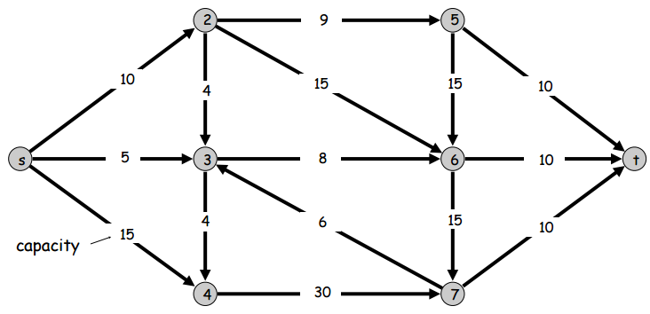  

Some quick notation: $c(e)$ is the capacity of an edge $e$.  The above graph $G$ consists of two sets $V$ and $E$, a set of vertices and edges respectively.  Note that node $s$ and node $t$ are special in that $s$ is the source node and $t$ is the target node.  The source node $s$ has no ingoing edges and the target node $t$ has no outgoing edges.  The target node is sometimes also called the 'sink' since flow goes in but not out.  

Note that throughout this page I refer to flow networks as "s-t graphs".  

## Cuts and Flows  

Let's define another term: an *s-t cut*.  An s-t cut is a special cut of an s-t graph where $s$ is in the cut and $t$ is not.  And here's another term: an *outcutset*.  An outcutset is the set of outgoing edges of a cutset.  Using these two definitions, let's define one more term: the *capacity* of an s-t cut.  The capacity of any s-t cut is simply the sum of the capacities of the edges in the s-t cut's outcutset.  Simple, right?  Here are two images for reference.  

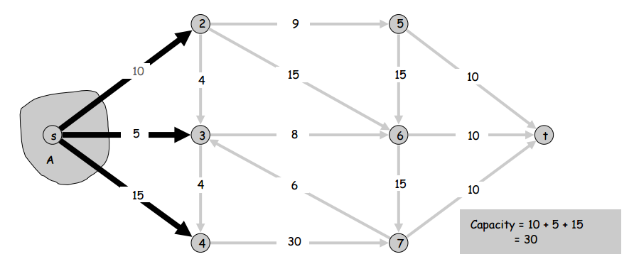  

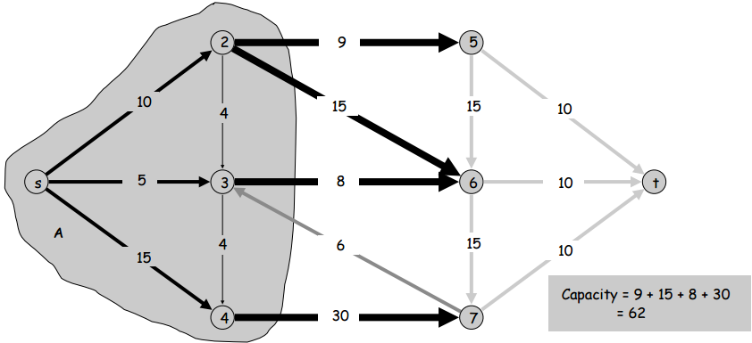  

Before we go on to talking about flows, let's take note of the problem that we'll be using all this terminology to define and solve: the minimum cut problem.  The minimum cut problem is the problem of finding the s-t cut with the minimum capacity in the s-t graph.  

Now we're ready for flows.  Just like every edge has a capacity, every edge also has a flow.  The flow of an edge is simply how much of the edge's capacity is actually in use.  Clearly the flow of an edge can't be greater than its capacity and it also can't be less than zero.  If the flow of some edge $e$ is $f(e)$, then we have $0 \le f(e) \le c(e)\ \forall e \in E$.  

Now let's talk about a special kind of set of flows, an *s-t flow*.  An s-t flow is a set of edge flows for the whole s-t graph such that for all vertices other than $s$ and $t$, the sum of the flows of a vertex's ingoing edges is equal to the sum of the flows of that vertex's outgoing edges.  Basically an s-t flow is just a set of flows for the whole graph where, besides nodes $s$ and $t$, all nodes' inflow is equal to outflow (all nodes have net zero flow).  Here's a picture of an s-t flow:  

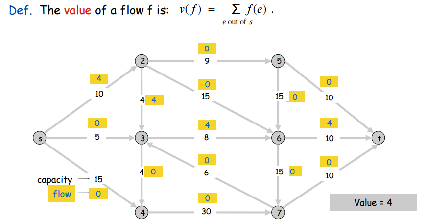  

As shown in the picture, there's an important idea we must discuss about s-t flows: the **value** of s-t flows.  As shown above, the value of an s-t flow is the sum of the source node $s$'s outflows.  But why does that number characterize the entire s-t flow?  Well, if you think about it, the total outflow of node $s$ is actually going to be the net flow of any s-t cut!  This also implies that node $t$'s total inflow is this same value, the value of the s-t flow.  This property is shown in the picture below:  

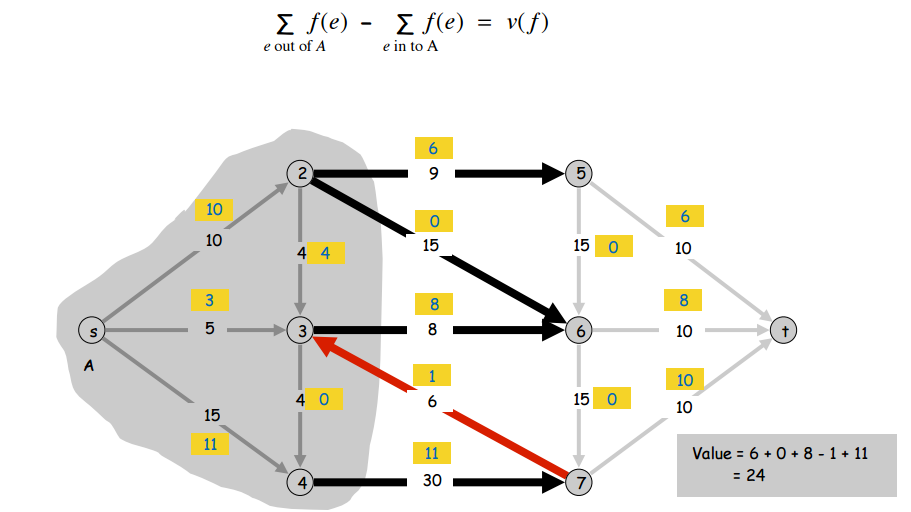  

## Max Flows  

Let's take note of an interesting property of s-t flows: for any s-t cut of a graph, no s-t flow can have a value greater than the capacity of an s-t cut.  It follows naturally from this that the minimum s-t cut capacity of a graph is equal to the max s-t flow value of the graph.  This is basically just the idea of the minimum s-t cut capacity being a bottleneck for all flows.  

We can phrase this one more way: for any s-t flow and any s-t cut, if the value of the s-t flow is equal to the capacity of the s-t cut, then the s-t flow is a max flow and the s-t cut is a min cut.  This is true because if the s-t flow is as big as some s-t cut capacity then you can't make the flow any bigger but also if the flow is a valid flow then the max flow isn't any smaller -- this is clearly the smallest flow for which you've maxed out some s-t cut's capacity.  

## Attempts at MaxFlow-finding Algorithm  

Maybe we can try a straightforward greedy algorithm to find the max flow of an s-t graph?  For example, let's pick some simple (simple as in contains no cycles) $s \rightarrow t$ path along which **all edges** have **capacities greater than their flows**.  In other words, a path from $s$ to $t$ where all edges can still have more flow added to them.  Our strategy will be to just augment the flow on all the edges of the path by the same amount until we can't.  Then we just repeat this for all the paths we can find whose every edge can have a flow increase.  The idea is that if we do this for every such path that we can, we will have increased the flow on all the paths of the s-t graph by the greatest possible amount.  Unfortunately, this won't work.  Here's a counter-example where we apply the strategy and it fails:  

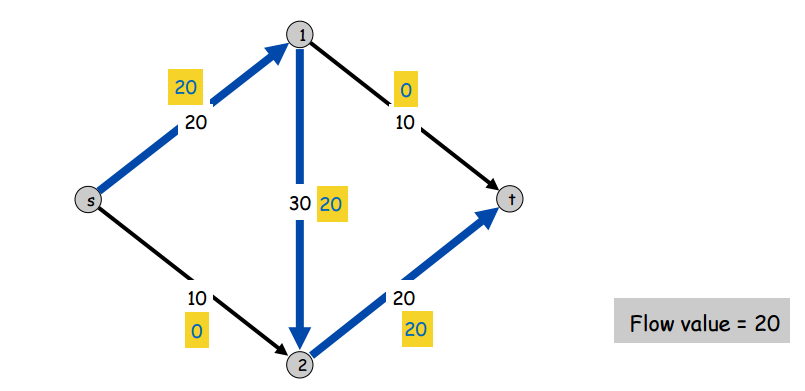  

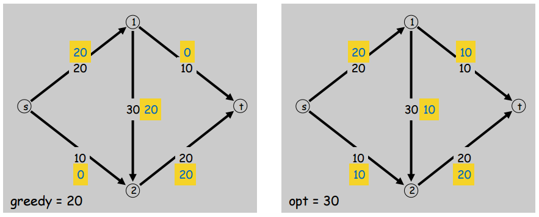  

Why did it fail?  We maxed out the blue $s \rightarrow t$ path and then weren't able to find any other $s \rightarrow t$ paths whose **every** edge has room for more flow -- even though there still are paths where **some** of the edges have more room for flow.  Notice that what we seem to be missing is some kind of way to backtrack and redistribute flow to make room on some edges to add more flow.  In this example, we would have liked to backtrack on edges $(2,t)$ and $(1,2)$, redirecting 10 flow to edge $(1,t)$ so that we could add 10 flow to edges $(s,2)$ and $(2,t)$ to get the optimal s-t flow of 30.  

## Augmenting Paths 

The failed strategy we just described involved finding a certain kind of $s \rightarrow t$ path: an **augmenting path**.  As it was described above, it's a path along which each edge has less flow than capacity.  In other words, an augmenting path is a path along which we can still **augment** the flow of each edge by at least some amount.  

That amount is called the **residual capacity** of each edge.  The residual capacity of an edge is therefore its capacity minus its flow.  

Of all the edges in an augmenting path, there will be one or more that have the smallest residual capacity.  When we augment the flow along the augmenting path, we will only be able to augment as much as the smallest residual capacity in the path (let's call this the "bottleneck capacity" of the augmenting path).  The other edges in the path might have much larger residual capacities that are being wasted.  If we broaden our definition of an augmenting path, we might be able to add and redistribute flow so that less residual capacity goes to waste.  

Let's now say that an augmenting path isn't just a path from $s$ to $t$ where we travel forward along edges that have a **non-zero residual capacity**, augmenting all flows by bottleneck capacity of the path.  Instead, let's say that we can also travel *backwards* along edges that have a **non-zero flow**.  How can this work?  Consider the following figure, which is a depiction of **some small portion of a much larger s-t graph**:  

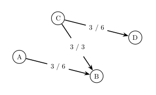  

Even though edge $(A,B)$ has a residual capacity of 3, we can't augment the flow by that amount since the increased flow will have nowhere to go.  But, the net flow of node $B$ will not change if we just decrease its inflow from another edge by 3 to compensate for our increase.  Of course, if we do this, by (for example) decreasing the flow along edge $(C,B)$, we will have to increase the flow along some edge coming out of node $C$, so that the net flow out of $C$ does not change either.  This is shown below.  

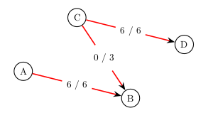  

We can think of what we just did as treating the entire path of three edges, including the backward one, as part of one augmenting path -- an augmenting path that includes backwards edges.  We were able to include backwards edges in our augmenting path using the following new definition of an augmenting path:  

>  An augmenting path goes along forward edges with non-zero residual capacity and backward edges with non-zero flow.  The bottleneck capacity of the augmenting path is the smallest residual capacity of a forward edge or smallest flow of a backward edge (whichever is smallest).  We increase the flow on forward edges by that amount and decrease it on backward edges by that amount do to our maximum augmentation of flow on the augmenting path.  

Now we have a better definition of an augmenting path.  The new definition lets us go backward along edges which, effectively, serves to redistribute flow and avoid the problems faced by the first algorithm we tried.  Let's see if by using the same strategy as before, but with the new definition of an augmenting path, we can get the optimal max flow on the s-t graph we tried our first algorithm on.  

## A Second Attempt at an Algorithm  

Here is a picture of the s-t graph (a.k.a. flow network) before we add any flow:  

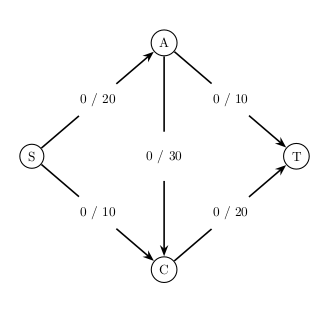  

The first augmenting path we find is $S \rightarrow A \rightarrow C \rightarrow T$.  It's bottleneck capacity is 20 so we augment all edge flows on the path by that amount.  Here is a picture of that:  

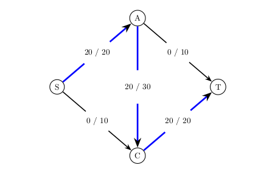  

The second and final augmenting path that we find is $S \rightarrow C \rightarrow A \rightarrow T$.  It's bottleneck capacity is 10 so we do the appropriate flow augmentation along the path.  Shown below:  

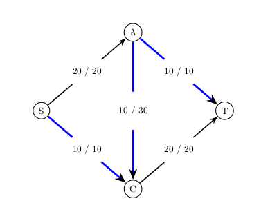  

It looks like the same algorithm with the improved definition of augmenting paths worked.  We got the optimal flow of 30.  To recap, the algorithm is:  Find an augmenting path and increase the flow along its edges by its bottleneck capacity.  Repeat until no augmenting paths.  

We're almost done but we still haven't discussed the best strategy of finding augmenting paths.  In the example we just went through, I went ahead and asserted that the first augmenting path that was found was $S \rightarrow A \rightarrow C \rightarrow T$.  But why not $S \rightarrow C \rightarrow T$?  Or $S \rightarrow A \rightarrow T$?  

##  Finding Augmenting Paths  

It's easy enough to see that no matter what strategy we use to find augmenting paths, as long as we augment until there are no augmenting paths left we will always produce the max flow.  But, we can also see that the strategy we use can have an effect on *how quickly* we find the max flow of the flow network.  

In the example from the last section, it only took 2 paths if we chose the paths $S \rightarrow A \rightarrow C \rightarrow T$ and $S \rightarrow C \rightarrow A \rightarrow T$.  It would have taken 3 if we had chosen $S \rightarrow A \rightarrow T$ then $S \rightarrow C \rightarrow T$ then $S \rightarrow A \rightarrow C \rightarrow T$.  So what's a good way of choosing paths?  

Consider that the two most obviously reasonable choices are: always pick the augmenting path with the greatest bottleneck capacity or always pick the augmenting path with the shortest number of edges.  In the example we just did, the faster choice would have been to pick the augmenting path with the greatest bottleneck capacity, which would have given us the two-path solution.  In fact, which strategy of the two strategies (or any other strategies you can think of) is best depends on the special properties of the flow network (if any) whose max flow you're trying to find.  In general, it's usually considered best to choose the shortest augmenting path first.  This is also convenient because it can be found with a simple breadth-first search.  

##  The Algorithm  

**INCOMPLETE**
