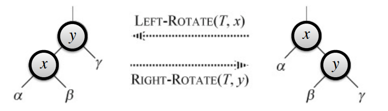
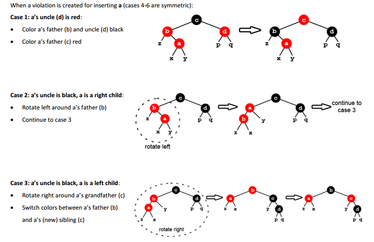

## RBTree Properties  

A red black tree is a binary tree that is always balanced. To achieve this, the root may  
change as you add elements, unlike a binary tree. The 3 RBTree properties are:  

1.  Root and leaves are black
2.  No two reds in a row (red node has both children black)
3.  All root-to-leaf paths have same number of black nodes (true for all subtrees also)

Before we move on, let's look at two quick definitions:  

**Height of a node**  
\# of edges in longest path from node to leaf  

**BlackHeight of a node**  
\# number of black child nodes along path to NULL leaf. NULL leaf has BlackHeight 0. 
For example the black node 7 on the left of the tree has BlackHeight 1.

## RBTree representation  

Notice that in practice all leaves are the same black NULL node and that only the root  
node has that same NULL as its parent node.  Note that in these notes, we won't show the  
NULL connections so we'd just show this:

Any pseudocode we write will use the fact that all the leaves are the NULL node and so is  
the root's parent.

## Rotations  

  

Here's some 'pseudocode' to do a left rotate for the above diagram.

~~~
LeftRotate(Tree t, node x) {
    y = x.right;            // take y's left
    x.right = y.left;       // subtree and make
    if (y.left != NULL) {   // it x's right
        y.left.parent = x;  // subtree.
    }

    y.parent = x.parent;                // make x's
    if (x.parent == NULL) {             // parent
        t.root = y;                     // y's new
    } else if (x.parent.left == x) {    // parent &
        x.parent.left = y;              // make y the
    } else {                            // parent's
        x.parent.right = y;             // correct
    }                                   // child.
    
    y.left = x;     // make x y's left child
    x.parent = y;   // make y x's parent
}
~~~

## Some extra facts about RBTrees

**For a node $x$ with height $h$, $blackheight(x) \ge {h \over 2}$.**  
Clearly true if no consecutive reds are allowed but consecutive blacks are.  

**A node $x$ must have at least $2^{blackheight(x)} - 1$ descendants. (not including NULLs)**  
The rigorous proof is pretty annoying but the intuition is pretty easy.  If we had a perfectly  
balanced and completely full binary tree, the root $x$ of any given subtree would clearly  
have at least $2^{height(x)} - 1$ descendants.  Well, an RBTree is always full and perfectly  
balanced with respect to blackheight (by property 3) -- and this is true  for all subtrees  
rooted at any node in the RBTree.  So the number of black descendants of any given node $x$  
in the RBTree is therefore always at least $2^{blackheight(x)} - 1$.  So, that fact paired  
with the fact that the blackheight of a node doesn't account for all the possible red nodes  
that can be sandwiched between all the black nodes means that for any node $x$ in the RBTree,  
$x$ always has **at least** $2^{blackheight(x)} - 1$ descendants. 

**An RBTree with $n$ descendants has height at most $2 log_2(n + 1)$**  
Let $n$ be the number of descendants of an RBTree, $h$ be its height and let $bh$ be its  
blackheight.  We just showed that $n \ge 2^{blackheight(x)} - 1$.  By simple algebra we can  
rearrange this to be $log_2(n+1) \ge bh$.  We also saw that $bh \ge {h \over 2}$.  So,  
$$
log_2(n+1) \ge bh \ge {h \over 2}\ \implies\ h \le 2 log_2(n+1)
$$
Realize that this statement is proof the RBTree is balanced.  We've shown that for the $n$  
elements and height $h$ of an RBTree, $h \in O(log(n))$.  This is the entire goal of RBTrees  
in the first place.  

## Insertion  

Insertion into an RBTree basically consists of two steps:  

1.  Insert a node as if into a regular binary search tree and then color it red  
2.  Correct any RBTree properties that may have been violated during the BST-style insertion  

Here's the pseudocode for the first step.  

~~~
Algorithm RBT Insertion(RBTree T, node n):
    Set n's color to red and both children to NULL
    Let c be the root node
    Let p be NULL

    If c == NULL            // handle the case of
        T.root = n          // n being added to
        n.color = black     // an empty RBTree
        return
    Endif

    While c is not NULL     // find the spot to
        p = c               // put the new node
        If n <= c           // just like you
            c = c.left      // would for a
        Else                // regular BSTree
            c = c.right
        Endif
    Endwhile

    n.p = p             // set the parent-child
    If n < p            // relationship between
        p.left = n      // n and its new parent
    Else                // appropriately
        p.right = n
    Endif

    call RBT Insertion Fixup(T,n)
Endalgorithm
~~~

So how does the second step, the fixup step, work?  Well, it turns out there are really  
just three possible cases where the insertion results in a violation of RBTree  
properties.  All three of those cases are defined in the picture below and are even  
accompanied by visual representations of typical examples.  

  

Before we inspect these cases and their fixes one-by-one, let's notice one thing first:  
In all three cases, the issue is that the new node was added as a child of a red node.  
Realize that **none of the RBTree properties are violated** if the new red node is added  
as a child of a black node.  Now that that's out of the way, let's take a closer look  
at each case.  

1.  **a's uncle (d) is red**  
    All we have to do to fix the problem is toggle the colors of a's parent, uncle and  
    grandfather.  Realize that from the perspective of node c's parent, the blackheight  
    of node c has not changed, so our work on this subtree really is done after the color  
    toggling.  The only issue is that by making c red, if c's parent was red we'd have a  
    problem.  So now we just call our insertion fixup recursively on c.  
2.  **a's uncle (d) is black and a is a right child**  
    In this case we're just trying to get the situation to be a case 3 so that we can then  
    apply the case 3 solution.  To do that we'll just rotate left around a's parent and  
    then call insertion fixup recursively on what just was a's parent.  
3.  **a's uncle (d) is black and a is a left child**  
    Just like it says in the diagram, to fix a case 3 you right-rotate your grandparent  
    and then toggle the color of your new parent and sibling.  When you finish a case 3,  
    you're done -- no more recursive calls.  

Okay, here's the pseudocode to achieve that:  

~~~
Algorithm Insertion Fixup(RBTree T, node n):
    If n.parent.color == red

        //if n's parent is a left child
        If n.parent == n.parent.parent.left 

            node uncle = n.parent.parent.right      // Case 1:
            If uncle.color == red                   // Toggle color of
                Toggle n.parent.color               // uncle, parent and
                Toggle uncle.color                  // grandparent.
                Toggle n.parent.parent.color        // Recursive call
                Recursive call on n.parent.parent   // on grandparent.
                Return;
            Else
                If n == n.parent.right      // Case 2:
                    n = n.parent            // Right-rotate around n's
                    Right-rotate on n       // parent and recursive 
                    Recursive call on n     // call on n's old parent.
                    Return
                Else
                    Right-rotate on n.parent.parent // Case 3:
                    Toggle n.parent.color           // Toggle color of
                    Toggle n.parent.right.color     // n's parent and
                    Return                          // new sibling.
                Endif                               // End of Alg.
            Endif

        //if n's parent is a right child
        Else
            // same as before but 
            // with "left" and "right"
            // exchanged
        Endif

    Endif
Endalgorithm
~~~

## Deletion  

If you really must know, you can find out how it works [here](ins_del_tut.pdf).  I hope  
you found this document helpful.
